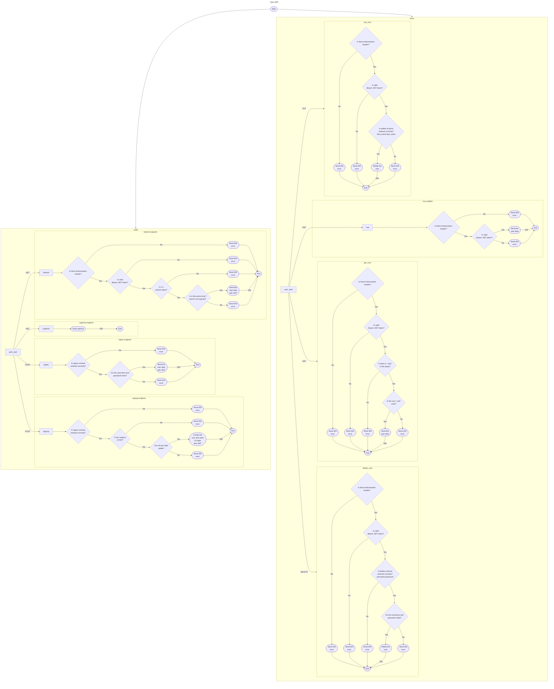

# xors api

Xors API is a REST API for the [xors](https://github.com/TheAwiteb/xors) project.

## Features
- [X] Full documentation using Swagger UI
- [X] JWT authentication with refresh tokens
- [X] Captcha support
- [X] Username and password validation
- [ ] Password reset
- [ ] Multiplayer support with websockets

## Requirements
The API can be run only using Docker and docker-compose.


## Installation
> [!NOTE]
> Update the `JWT_SECRET` in `docker-compose.yml` file.
> You can use `openssl rand -hex 32` to generate a random secret.

```bash
git clone https://github.com/TheAwiteb/xors
cd xors
# After updating the JWT_SECRET
docker-compose up -d
```

<!-- ## Log file

> [!warning]
> The log file will be rewritten every time you restart the API.

The log file is located at `/app/logs/xors.log` inside the container, you can access it using the following command:
```bash
docker cp xors_api_1:/app/logs/xors_api.log xors_api.log
``` -->

### Database
The PostgreSQL database is in a separate container, and doesn't have any connection to the host machine.

#### Backup
To backup the database, you can use the following command:
```bash
docker-compose exec db bash -c "export PGPASSWORD=mypassword && pg_dump -U myuser xors_api_db" | gzip -9 > "xors_api_db-postgres-backup-$(date +%d-%m-%Y"_"%H_%M_%S).sql.gz"
```

#### Restore
To restore the database, you can use the following command:

> [!NOTE]
> Replace `xors_api_db-postgres-backup-17-01-2024_20_46_15.sql.gz` with the backup file name.
> And replace `xors_api_db-postgres-backup-17-01-2024_20_46_15.sql` with the backup file name without `.gz` extension.

```bash
# Stop the API
docker-compose stop api
# Restore the database
gunzip -k xors_api_db-postgres-backup-17-01-2024_20_46_15.sql.gz && \
        docker cp xors_api_db-postgres-backup-17-01-2024_20_46_15.sql xors_db_1:/pg-backup.sql && \
        docker-compose exec db bash -c "export PGPASSWORD=mypassword && dropdb -U myuser xors_api_db --force && createdb -U myuser xors_api_db && psql -U myuser xors_api_db < pg-backup.sql"
# Start the API
docker-compose start api
```

## API
After running the server, you can access the API documentation at `http://0.0.0.0:8000/api-doc/swagger-ui/`

### Development
For development, you need to have this requirements:
- [cargo (Rust)](https://doc.rust-lang.org/cargo/getting-started/installation.html)
- [just](https://crates.io/crates/just)
- [cargo-dotenv](https://crates.io/crates/cargo-dotenv)
- [docker-compose](https://docs.docker.com/engine/install/)

#### Run the database
For the database, we will run it in a docker container, you can run it using the following command:
```bash
docker-compose up -d db
```

#### Run the API
To run the API, you need to run the following command:
```bash
just run
```

#### Run the CI
To run the CI, you need to run the following command:
```bash
just ci
```

#### Close the database
To close the database, you need to run the following command:
```bash
docker-compose stop db
```

### Flowchart
You can find the flowchart of the API at [`flowchart.mermaid`](./flowchart.mermaid) file. And this is how it looks like:



## License
This project is licensed under the AGPL-3.0 License - see the [LICENSE](LICENSE) file for details
